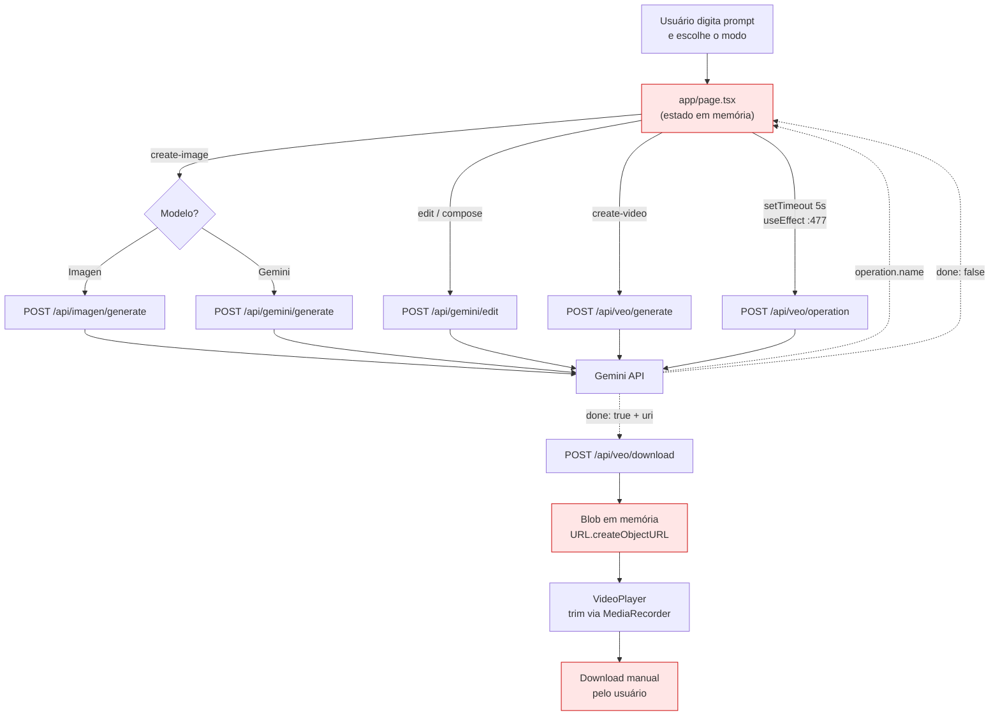
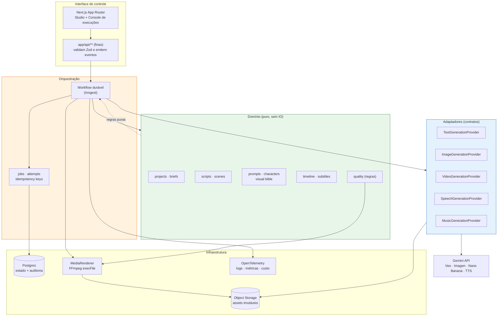
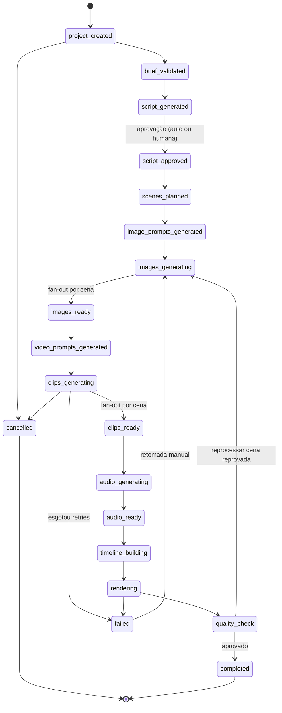
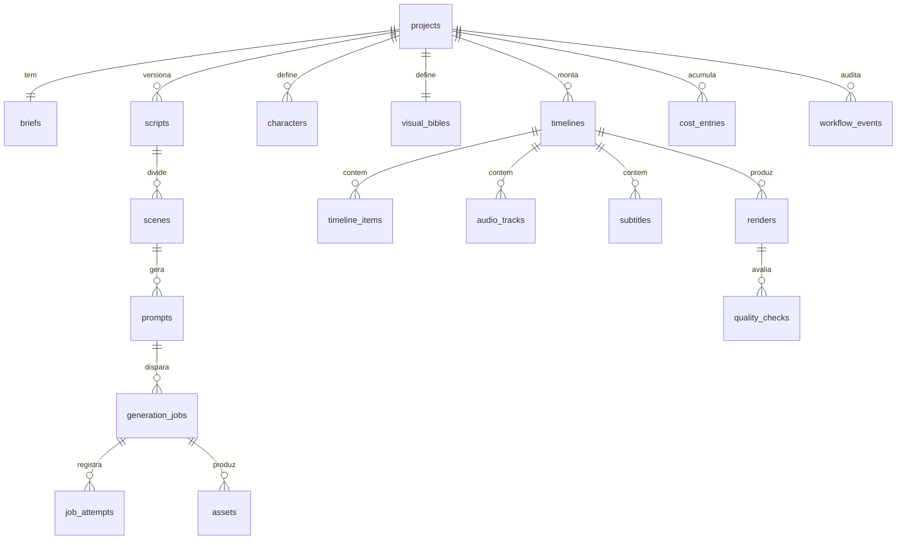
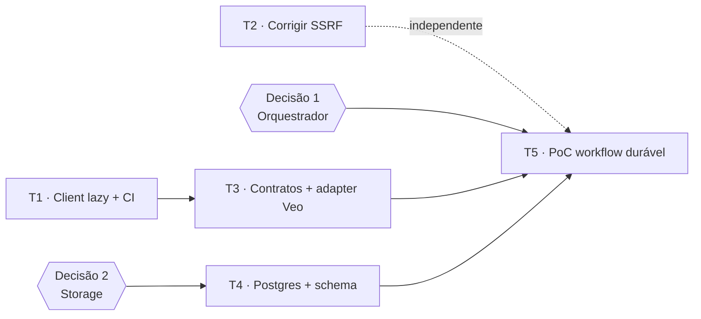

# Plano técnico — Pipeline automatizado de geração de imagens e vídeos

> **Projeto:** NANO-VEO3-API · **Data:** 26/07/2026 · **Branch:** `arena/019f9d65-nano-veo3-api`
> **Status:** proposta para revisão — **nenhum código de aplicação foi alterado nesta etapa**.
>
> **➜ As 3 decisões pendentes deste plano já foram resolvidas em
> [`DECISOES-TECNICAS.md`](./DECISOES-TECNICAS.md):** container no Railway, Inngest como
> orquestrador e Veo 3.1 Lite 720p como padrão de custo. Esse documento também registra um achado
> urgente: **os modelos `veo-3.0-*` e `veo-2.0-*` usados no código foram desligados em 30/06/2026**.

## Convenção de rotulagem das afirmações

Para separar fato de recomendação, todo item relevante é marcado:

| Marca       | Significado                                                                      |
| ----------- | -------------------------------------------------------------------------------- |
| `[CÓDIGO]`  | Confirmado lendo/executando arquivos deste repositório (caminho e linha citados) |
| `[DOC]`     | Confirmado na documentação oficial ou nos _type definitions_ instalados          |
| `[REC]`     | Recomendação minha — não é fato, é escolha de projeto                            |
| `[DECIDIR]` | Depende de decisão do time; não dá para responder só com o workspace             |

---

## 1. Resumo executivo

O repositório **não é hoje um pipeline** — é uma UI interativa single-page de disparo manual. A
distância entre o que existe e o objetivo dos 12 passos pedidos é grande, mas a base é aproveitável:
os 6 endpoints de API já encapsulam corretamente as três famílias de modelos (Veo, Imagen, Gemini
Image) e o padrão submit→poll→download já está implementado, ainda que no lugar errado.

Cinco constatações que definem o plano:

1. **Não existe nenhuma persistência.** `[CÓDIGO]` Zero banco, zero migração, zero ORM. O estado da
   geração vive em `useState`/`useRef` de `app/page.tsx`. Recarregar a página perde o vídeo.
2. **O orquestrador é o navegador.** `[CÓDIGO]` O polling do Veo roda em `useEffect`
   (`app/page.tsx:477-519`). Fechar a aba mata o acompanhamento; a operação continua sendo cobrada
   no Google, mas o resultado é perdido para sempre.
3. **Não há fila, worker, retry, idempotência ou storage.** `[CÓDIGO]` Busca textual por
   `queue|worker|job|retry|storage|timeline|ffmpeg|scene|storyboard` em `app/`, `components/`,
   `lib/`, `scripts/` retorna **0 arquivos** para cada termo.
4. **O binário FFmpeg não existe no projeto nem no ambiente.** `[CÓDIGO]` `which ffmpeg` → _not
   found_; nenhum Dockerfile. O "corte de vídeo" atual é feito no browser via `MediaRecorder`
   (`components/ui/VideoPlayer.tsx:231-242`), que **re-encoda em tempo real e degrada qualidade** —
   inviável para montagem de timeline.
5. **O projeto usa uma fração pequena do que o SDK já oferece.** `[DOC]` O `@google/genai@2.12.0`
   instalado expõe `seed`, `lastFrame`, `referenceImages`, `durationSeconds`, `resolution`,
   `negativePrompt`, `responseSchema` e `speechConfig`/`MultiSpeakerVoiceConfig`. O código atual usa
   apenas `aspectRatio` e `negativePrompt` (`app/api/veo/generate/route.ts:49-56`).

O ponto 5 é a boa notícia: **consistência visual entre cenas, keyframes inicial/final, narração TTS
e saída estruturada validável não exigem novos fornecedores** — estão no SDK que já está no
`package.json`.

> **Aviso sobre o Context7:** o MCP está declarado em `.mcp.json` mas **não foi possível usá-lo**
> neste ambiente. Detalho a limitação e o método substitutivo (mais forte, na verdade) na seção 6.

---

## 2. Evidências encontradas no workspace

### 2.1 Inventário real do código de aplicação

`[CÓDIGO]` 17 arquivos, 2.506 linhas. Isto é **todo** o software do projeto:

```
app/api/gemini/edit/route.ts        145 linhas
app/api/gemini/generate/route.ts     58
app/api/imagen/generate/route.ts     46
app/api/veo/download/route.ts        62
app/api/veo/generate/route.ts        68
app/api/veo/operation/route.ts       36
app/layout.tsx                       41
app/page.tsx                        967   ← 39% de todo o código
components/ui/Composer.tsx          339
components/ui/ModelSelector.tsx      61
components/ui/VideoPlayer.tsx       535
components/ui/dropzone.tsx           57
components/ui/skeleton.tsx           24
components/ui/tooltip.tsx            61
lib/utils.ts                          6   ← única "lib": função cn()
```

### 2.2 Busca por termos do domínio de pipeline

`[CÓDIGO]` Executado sobre `app/ components/ lib/ scripts/` (excluindo `.agents/`, que é conteúdo de
agentes, não software executável):

| Termo     | Arquivos | Termo                  | Arquivos |
| --------- | -------- | ---------------------- | -------- |
| `queue`   | **0**    | `storyboard`           | **0**    |
| `worker`  | **0**    | `scene`                | **0**    |
| `job`     | **0**    | `shot`                 | **0**    |
| `retry`   | **0**    | `timeline`             | **0**    |
| `storage` | **0**    | `ffmpeg`               | **0**    |
| `webhook` | **0**    | `subtitle` / `caption` | **0**    |
| `render`  | **0**    | `tts` / `voice`        | **0**    |
| `seed`    | **0**    | `asset`                | **0**    |

Os únicos "hits" aparentes (`provider`, `asset`) são falsos positivos: `TooltipProvider` do Radix e
`rc-slider/assets/index.css`. **Conclusão: o domínio de pipeline não existe em código.**

### 2.3 Ausências de infraestrutura

`[CÓDIGO]` Verificado por busca no repositório e no ambiente:

- Sem `Dockerfile` / `docker-compose` → sem forma declarada de garantir FFmpeg em produção.
- Sem `.sql`, sem Prisma, sem Drizzle → sem banco e sem migrações.
- Sem testes (`*.test.*`, `*.spec.*`) → nenhuma rede de segurança para refatorar.
- `which ffmpeg` → não encontrado.
- `public/uploads/` contém `frame_start.png` e `frame_end.jpg` versionados e **não referenciados por
  nenhum código** — resíduo manual que sugere que alguém já testou keyframes à mão.

### 2.4 O que já existe de valioso e deve ser preservado

`[CÓDIGO]` Três ativos reais:

1. **Os 6 adapters implícitos.** Cada `route.ts` já é, na prática, um adaptador de provedor: converte
   `FormData`→base64, chama o SDK, normaliza a resposta. É a semente da camada `providers/`.
2. **O ciclo submit→poll→download do Veo.** `app/api/veo/generate` (retorna `operation.name`) →
   `app/api/veo/operation` (repolla) → `app/api/veo/download` (baixa com `x-goog-api-key`). A lógica
   está correta; só está orquestrada no lugar errado (browser).
3. **O design de pipeline em prosa dentro de `.agents/workflows/`.** `institutional-video.md` já
   descreve 7 fases (Brief Intake → Aesthetic → Scene Planning → Scene Pack → Narration → Assembly →
   Handoff), e `orchestrate_generation.py` esboça diretórios `inputs/prompts/outputs`. **Isto é
   especificação de domínio já escrita pelo dono do projeto** e o plano abaixo a converte em código.

---

## 3. Arquitetura atual

### 3.1 Visão geral

| Aspecto           | Situação `[CÓDIGO]`                                                         |
| ----------------- | --------------------------------------------------------------------------- |
| Finalidade        | Studio interativo de disparo manual, 1 artefato por vez                     |
| Stack             | Next.js 16.2.10 (App Router, Turbopack), React 19.2.7, TS 5.9.3, Tailwind 4 |
| SDK IA            | `@google/genai@2.12.0`                                                      |
| Execução          | `npm run dev` / `npm run build` / `npm start`                               |
| Pontos de entrada | 1 página (`app/page.tsx`) + 6 rotas `POST`                                  |
| Serviços internos | **Nenhum** (sem worker, sem cron, sem fila)                                 |
| Serviços externos | Apenas Gemini API (Veo, Imagen, Gemini Image)                               |
| Persistência      | **Nenhuma** — estado em memória do browser                                  |
| Observabilidade   | 19 `console.log` + 4 `alert()`                                              |

### 3.2 Componentes

**`app/page.tsx` (967 linhas) — o "monólito de cliente"**

- Responsabilidade: acumula UI, máquina de modos, orquestração, polling, download e trim.
- Estado persistido: nenhum — 15+ `useState` e 5 `useRef` voláteis.
- Riscos: é simultaneamente view, controller e orquestrador; qualquer pipeline real precisa extrair
  essa lógica para o servidor.
- Reuso: as funções `generateWithImagen` (`:233`), `generateWithGemini` (`:269`), `editWithGemini`
  (`:305`) e `composeWithGemini` (`:355`) são **quase idênticas** (mesmo try/catch, mesmo parse
  `json.image.imageBytes`, mesmo `alert` no erro) — candidatas óbvias a um único cliente tipado.

**`app/api/veo/*` — o embrião do provider**

- `generate/route.ts:49-56` monta o `config` com apenas `aspectRatio` e `negativePrompt`.
- `operation/route.ts:26-28` usa `as unknown as never` para contornar a tipagem do SDK — gambiarra
  que some ao usar o objeto `operation` inteiro `[DOC]`.
- `download/route.ts:16-22` faz `fetch(uri)` com a chave no header e `redirect: "follow"`, sem
  validar o host → **SSRF** (detalhado em §15).

**`components/ui/VideoPlayer.tsx` (535 linhas) — pós-produção improvisada**

- Trim via `MediaRecorder` (`:231-242`): captura a reprodução em tempo real. Um corte de 8s leva 8s
  e re-encoda com perda. Não concatena, não sobrepõe legenda, não mixa áudio.

### 3.3 Fluxo atual



Em vermelho: os pontos onde **o artefato existe apenas na aba do navegador**. Não há nenhuma escrita
em disco ou banco em todo o fluxo.

---

## 4. Fluxo atual, passo a passo (e onde ele quebra)

1. Usuário escreve prompt e clica gerar → `startGeneration` (`app/page.tsx:415`).
2. `POST /api/veo/generate` com `multipart/form-data`; servidor chama `ai.models.generateVideos` e
   devolve `{ name }`.
3. O **browser** guarda `operationName` em `useState` e agenda `setTimeout` de 5s.
4. A cada ciclo, `POST /api/veo/operation`. **Sem limite de tentativas, sem timeout, sem backoff.**
5. Quando `done`, extrai `response.generatedVideos[0].video.uri` e chama `/api/veo/download`.
6. O blob vira `objectURL` e é exibido. **Nada é salvo.**

**Pontos de quebra confirmados** `[CÓDIGO]`:

- Fechar/recarregar a aba entre os passos 3 e 5 → vídeo perdido, custo já incorrido.
- Erro de rede no passo 4 → `catch` faz `setIsGenerating(false)` (`:508`) e **encerra o polling**; a
  operação continua no Google, mas o app desiste.
- `[DOC]` A URI do vídeo expira: arquivos ficam **2 dias** armazenados. Sem download+persistência
  imediatos, o link morre.

---

## 5. Problemas e riscos

| #   | Problema                            | Sev.        | Evidência                                                                | Impacto                                               | Esforço |
| --- | ----------------------------------- | ----------- | ------------------------------------------------------------------------ | ----------------------------------------------------- | ------- |
| 1   | Orquestração no browser             | **Crítica** | `app/page.tsx:477-519`                                                   | Perda de artefato pago; impossível automatizar        | G       |
| 2   | Zero persistência                   | **Crítica** | ausência de DB/migrações                                                 | Sem histórico, sem reprocessamento parcial            | G       |
| 3   | Sem storage de artefatos            | **Crítica** | `download/route.ts` devolve stream ao browser                            | URI expira em 2 dias `[DOC]`; resultado irrecuperável | M       |
| 4   | SSRF no download                    | **Alta**    | `download/route.ts:16-22` — `fetch(uri)` sem allowlist + chave no header | Exfiltração da `GEMINI_API_KEY`                       | P       |
| 5   | Sem retry/backoff/idempotência      | **Alta**    | nenhum `retry` no código                                                 | Falha transitória = perda de cena inteira             | M       |
| 6   | Build exige `GEMINI_API_KEY`        | **Alta**    | `throw` no escopo do módulo nas 6 rotas                                  | Quebra CI/CD (validado no turno anterior)             | P       |
| 7   | Sem validação de resposta do modelo | **Alta**    | `response.candidates[0]...` sem guarda (`gemini/generate:28`)            | `TypeError` em safety-block → 500 opaco               | P       |
| 8   | Pós-produção via `MediaRecorder`    | **Alta**    | `VideoPlayer.tsx:231-242`                                                | Re-encode com perda; não concatena/mixa/legenda       | M       |
| 9   | Consistência visual inexistente     | **Alta**    | sem `seed`/`referenceImages` no código                                   | Cada cena parece de um filme diferente                | M       |
| 10  | Lógica duplicada 4× no cliente      | Média       | `page.tsx:233,269,305,355`                                               | Divergência de comportamento e de erro                | P       |
| 11  | Sem observabilidade                 | Média       | 19 `console.log`, 4 `alert()`                                            | Sem custo/latência/tracing por execução               | M       |
| 12  | Sem controle de concorrência/custo  | Média       | nenhum limite no código                                                  | Rate-limit do provedor e estouro de orçamento         | M       |

---

## 6. Pesquisa técnica — Context7 e o método efetivamente usado

### 6.1 O que aconteceu com o Context7 (transparência)

O MCP está declarado `[CÓDIGO]` em `.mcp.json` (`npx -y ctx7@latest mcp`). Eu **tentei usá-lo**:

- `npx ctx7@latest --help` → **funcionou** (CLI baixa e executa normalmente).
- `npx ctx7@latest library "@google/genai" "generateVideos veo"` → **`✖ fetch failed`**.
- `curl https://context7.com` e `curl https://mcp.context7.com` → **`SSL_ERROR_SYSCALL`, HTTP 000**.
- `curl https://registry.npmjs.org` → **HTTP 200**.

Ou seja: **o sandbox bloqueia o egress para o backend do Context7** (a mesma restrição que impede
`fonts.googleapis.com`). Não é erro de configuração do repositório, e o `ctx7 whoami` ainda indica
"Not logged in" — mesmo autenticado, a rede impediria a consulta.

### 6.2 Método substitutivo — mais autoritativo que o Context7 para o caso crítico

Em vez de presumir assinaturas, li **os _type definitions_ do SDK realmente instalado**
(`node_modules/@google/genai/dist/genai.d.ts`, v2.12.0) e complementei com a documentação oficial via
fetch. Para "não inventar assinaturas", isto é **superior** a um índice de documentação: reflete
exatamente a versão que o `package-lock.json` resolve.

### 6.3 Capacidades confirmadas no SDK instalado

`[DOC]` `GenerateVideosConfig` (`genai.d.ts:5422-5476`) — campos hoje **não usados** pelo projeto:

| Campo                | Tipo                              | Relevância para o pipeline                       |
| -------------------- | --------------------------------- | ------------------------------------------------ |
| `seed`               | `number`                          | Reprodutibilidade entre cenas                    |
| `lastFrame`          | `Image`                           | **Keyframe final** → continuidade cena→cena      |
| `referenceImages`    | `VideoGenerationReferenceImage[]` | **Consistência de personagem/estilo**            |
| `durationSeconds`    | `number`                          | Controle de duração por cena                     |
| `resolution`         | `string`                          | 720p/1080p/4k                                    |
| `generateAudio`      | `boolean`                         | Áudio nativo (evita mixagem manual)              |
| `negativePrompt`     | `string`                          | Já usado                                         |
| `numberOfVideos`     | `number`                          | Variações por cena                               |
| `pubsubTopic`        | `string`                          | Notificação de progresso (alternativa a polling) |
| `compressionQuality` | enum                              | Custo/qualidade                                  |

`[DOC]` `VideoGenerationReferenceType` (`genai.d.ts:15491-15503`) aceita exatamente dois valores:
**`ASSET`** (personagem/objeto/cenário) e **`STYLE`** (estética/cor/iluminação). Isto mapeia
diretamente na "bíblia visual" da §12.

`[DOC]` `GenerateImagesConfig` (`:5343-5387`) expõe `seed`, `negativePrompt`, `aspectRatio`,
`guidanceScale`, `numberOfImages`, `safetyFilterLevel`, `addWatermark`, `outputMimeType`.

`[DOC]` Saída estruturada: `responseSchema` e `responseMimeType` existem (`:5026-5037`) → o passo
"gerar e validar roteiro/cenas" pode exigir JSON conforme schema **no próprio modelo**, e não só
validar depois.

`[DOC]` TTS nativo: `speechConfig` e `MultiSpeakerVoiceConfig` (`:5086`, `:10205`) → narração
multi-locutor **sem contratar ElevenLabs**, ao contrário do que `.agents/workflows/` pressupõe.

### 6.4 Restrições do provedor que moldam a arquitetura

`[DOC]` Da documentação oficial do Veo 3.1:

- Vídeos de **8 segundos**; 720p/1080p/4k; `16:9` ou `9:16`.
- **Extensão**: +7s por vez, até 20 vezes, máx. 148s — **só para vídeos gerados pelo Veo**, entrada
  obrigatoriamente **720p**.
- **Até 3 imagens de referência** para preservar aparência do sujeito.
- **First/last frame**: `image` = primeiro frame, `config.lastFrame` = último.
- **Armazenamento de 2 dias** (renovado se o vídeo for referenciado em extensão).
- Files API: expiração de **48h**, limite de **2 GB/arquivo** e **20 GB/projeto**.

> **Consequência de projeto:** o download+persistência precisa acontecer **dentro da janela de 2
> dias, automaticamente**, senão o artefato pago evapora. Isso torna o problema #3 crítico, não
> cosmético.

### 6.5 Nota sobre direção futura da API

`[DOC]` A documentação atual recomenda a **Interactions API** e o **Gemini Omni Flash** como padrão
para vídeo, reservando o Veo 3.1 para "scene extension, last-frame control, ou integração com
pipelines legados". Como o pipeline aqui depende justamente de _last-frame_ e _extension_, **Veo 3.1
continua adequado** `[REC]`, mas a camada `providers/` (§11) existe precisamente para permitir trocar
isso sem tocar no domínio. `[DECIDIR]` avaliar Omni Flash em prova de conceito na Fase 5.

---

## 7. Comparação das soluções pesquisadas

### 7.1 Orquestração

| Solução        | Compatibilidade                         | Benefícios                                                         | Limitações                                                                   | Adoção | Veredito              |
| -------------- | --------------------------------------- | ------------------------------------------------------------------ | ---------------------------------------------------------------------------- | ------ | --------------------- |
| **Inngest**    | Alta — SDK Next.js, roda como rota HTTP | Steps duráveis, retry por step, concorrência, dashboard; sem Redis | Executa dentro da sua função → herda timeout do host; preço por execução     | Baixa  | **Adotar** `[REC]`    |
| Trigger.dev v4 | Alta                                    | Sem limite de duração, ótimo p/ IA, self-host                      | Runtime dedicado, mais peça operacional                                      | Média  | **Avaliar** (plano B) |
| BullMQ + Redis | Média                                   | Controle total, barato em escala                                   | Exige Redis + worker sempre ligado; **durabilidade por step é problema seu** | Alta   | Não adotar agora      |
| Temporal       | Média                                   | Durabilidade máxima                                                | Overkill; cluster + curva de aprendizado                                     | Alta   | Não adotar            |

**Por que Inngest** `[REC]`: o gargalo real deste pipeline não é throughput (são dezenas de jobs, não
milhões) — é **durabilidade e reprocessamento parcial**, exatamente os pontos 1, 2 e 5 da tabela de
problemas. Com `step.run`, cada cena vira unidade idempotente e re-executável isoladamente, que é o
requisito 12 do briefing. BullMQ entregaria fila, mas o checkpoint por etapa teria de ser escrito à
mão — reintroduzindo o problema que queremos eliminar.

`[DECIDIR]` Se houver exigência de self-hosting/dados em território nacional, a escolha inverte para
Trigger.dev (self-host) ou BullMQ.

### 7.2 Persistência

| Solução                | Veredito                                                                    |
| ---------------------- | --------------------------------------------------------------------------- |
| **Postgres + Drizzle** | **Adotar** `[REC]` — SQL puro, migrações versionadas, tipos inferidos, leve |
| Prisma                 | Avaliar — DX excelente, mas engine binária atrapalha em serverless          |
| SQLite                 | Só para dev local                                                           |

Não há banco algum hoje `[CÓDIGO]`, então não estou "impondo banco novo" sobre um existente — estou
preenchendo um vazio. O modelo é fortemente relacional (projeto→cena→job→asset) e precisa de JSONB
para prompts/parâmetros: Postgres atende os dois.

### 7.3 Pós-produção

| Solução                                 | Veredito                                                                                                                              |
| --------------------------------------- | ------------------------------------------------------------------------------------------------------------------------------------- |
| **FFmpeg via `child_process.execFile`** | **Adotar** `[REC]`                                                                                                                    |
| `fluent-ffmpeg`                         | **Não adotar** — `[DOC]` arquivado em 22/05/2025, o próprio README diz que "não funciona corretamente com versões recentes do ffmpeg" |
| `ffmpeg.wasm`                           | Não adotar no servidor — muito mais lento                                                                                             |
| `MediaRecorder` (atual)                 | **Remover** do caminho de produção                                                                                                    |

`execFile` com array de argumentos (nunca string concatenada) elimina _command injection_ por
construção, e evita depender de wrapper abandonado.

### 7.4 Validação e observabilidade

| Solução                  | Veredito                                                                    |
| ------------------------ | --------------------------------------------------------------------------- |
| **Zod**                  | **Adotar** — já é exigência do `AGENTS.md` e hoje não é cumprida `[CÓDIGO]` |
| `responseSchema` do SDK  | **Adotar** em conjunto — restringe na origem `[DOC]`                        |
| **OpenTelemetry + Pino** | **Adotar** `[REC]` — traço API→workflow→provedor                            |
| Langfuse                 | Avaliar — bom para custo/prompt de LLM `[DECIDIR]`                          |

### 7.5 Storage

`[DECIDIR]` S3/R2/GCS ou disco local. `[REC]` Interface `StorageProvider` (§11) com implementação
local em dev e S3-compatível em produção — a decisão não bloqueia as fases 1–3.

---

## 8. Arquitetura proposta



**Regra estruturante:** o domínio (verde) **não importa** nada de `@google/genai`, de FFmpeg ou do
banco. Ele decide _o que_ fazer; os adaptadores (azul) sabem _como_. Isso é o que permite trocar Veo
por Omni Flash — ou acrescentar um segundo provedor — sem reescrever regra de negócio.

### Estrutura de diretórios proposta `[REC]`

```
src/
  domain/        projects, scripts, scenes, prompts, characters, timeline, quality
  workflows/     definições duráveis (1 arquivo por etapa)
  providers/     contratos + adapters (google/*, storage/*, renderer/*)
  persistence/   schema Drizzle, repositórios, migrações
  media/         builder de comandos FFmpeg + probe
  observability/ logger, tracing, métricas, custo
app/
  api/           rotas finas (validação + enfileiramento)
  (studio)/      UI atual, preservada
  (console)/     nova UI operacional
```

`[REC]` Adotar `src/` exige ajustar o alias `@/*` em `tsconfig.json` (hoje aponta para `./*`
`[CÓDIGO]`). Alternativa sem migração: manter `lib/` como raiz do domínio. `[DECIDIR]`

---

## 9. Workflow proposto

### 9.1 Máquina de estados



### 9.2 Especificação por etapa

Notação: **Idem.** = chave de idempotência; **Par.** = paralelizável.

| Etapa                     | Entrada → Saída                    | Validação                                            | Falhas                           | Retry / Timeout      | Idem.                              | Par.                          |
| ------------------------- | ---------------------------------- | ---------------------------------------------------- | -------------------------------- | -------------------- | ---------------------------------- | ----------------------------- |
| `brief_validated`         | briefing → brief normalizado       | Zod: duração, aspect, idioma, tom                    | campos ausentes                  | 0 / 10s              | `brief:{hash}`                     | não                           |
| `script_generated`        | brief → roteiro                    | `responseSchema` + Zod `[DOC]`                       | safety block, JSON inválido      | 3 exp. / 120s        | `script:{brief}:{v}`               | não                           |
| `script_approved`         | roteiro → aprovado                 | gate humano ou heurística                            | timeout de aprovação             | — / 7d               | `approval:{script}`                | não                           |
| `scenes_planned`          | roteiro → N cenas                  | soma das durações ≈ alvo; **cada cena ≤ 8s** `[DOC]` | divisão incoerente               | 2 / 60s              | `scenes:{script}`                  | não                           |
| `image_prompts_generated` | cena + bíblia visual → prompt      | Zod; termos canônicos presentes                      | prompt genérico                  | 2 / 60s              | `imgprompt:{scene}:{v}`            | **sim**                       |
| `images_generating`       | prompt → keyframes                 | mime, dimensão, aspect                               | safety, rate-limit, timeout      | 3 exp.+jitter / 180s | `img:{scene}:{promptHash}:{seed}`  | **sim** (limite por provedor) |
| `video_prompts_generated` | cena + keyframes → prompt de vídeo | Zod; câmera/movimento presentes                      | —                                | 2 / 60s              | `vidprompt:{scene}:{v}`            | **sim**                       |
| `clips_generating`        | prompt + first/last frame → clipe  | `done`, `uri` presente, probe OK                     | **URI expira em 2 dias** `[DOC]` | 3 / **20min**        | `clip:{scene}:{promptHash}:{seed}` | **sim**                       |
| `audio_generating`        | roteiro → narração/trilha/SFX      | duração ≈ cena; sem clipping                         | voz indisponível                 | 3 / 300s             | `audio:{scene}:{textHash}`         | **sim**                       |
| `timeline_building`       | clipes+áudio+legendas → EDL        | soma = duração alvo; sem gaps                        | asset faltando                   | 2 / 60s              | `timeline:{project}:{v}`           | não                           |
| `rendering`               | EDL → MP4 final                    | exit code 0; probe do output                         | falta de disco, codec            | 2 / 30min            | `render:{edlHash}`                 | não                           |
| `quality_check`           | MP4 → laudo                        | §13                                                  | —                                | 1 / 300s             | `qc:{renderId}`                    | parcial                       |

**Nota crítica sobre a idempotência dos clipes:** a chave inclui `promptHash` **e** `seed`. Sem o
seed, um retry geraria um vídeo _diferente_ e a cena deixaria de casar com as vizinhas — o retry
"bem-sucedido" quebraria a continuidade. Esse é o tipo de bug que só aparece em produção.

### 9.3 Reprocessamento parcial (requisito 12)

Como cada asset é imutável e endereçado pela chave de idempotência, reprocessar a cena 7 significa:
invalidar os assets cuja chave contenha `scene:7`, reexecutar apenas os steps dependentes e
reconstruir a timeline. Clipes das cenas 1–6 e 8–N são reaproveitados sem nova chamada paga.

---

## 10. Modelo de dados

`[REC]` Postgres. Todas as tabelas com `id` (UUID v7), `created_at`, `updated_at`; auditoria por
`workflow_events` (append-only) em vez de triggers.



Entidades principais (campos essenciais, não exaustivo):

| Entidade          | Campos-chave                                                                             | Índices                                             | Versionamento                         |
| ----------------- | ---------------------------------------------------------------------------------------- | --------------------------------------------------- | ------------------------------------- |
| `projects`        | `status`, `target_duration_s`, `aspect_ratio`, `budget_cap_cents`                        | `(status)`                                          | —                                     |
| `briefs`          | `raw_input`, `normalized` (JSONB), `language`, `tone`                                    | `(project_id)`                                      | imutável                              |
| `scripts`         | `version`, `content` (JSONB), `approved_at`, `approved_by`                               | `(project_id, version)`                             | **nova linha por versão**             |
| `scenes`          | `index`, `duration_s`, `narration`, `continuity_notes`                                   | `(script_id, index)`                                | segue o script                        |
| `visual_bibles`   | `palette`, `lighting`, `lens`, `style_refs`, `negative_prompt`                           | `(project_id)`                                      | versionada                            |
| `characters`      | `canonical_description`, `reference_asset_ids`, `seed`                                   | `(project_id)`                                      | versionada                            |
| `prompts`         | `kind` (image/video/audio), `text`, `params` (JSONB), `version`, `hash`                  | `(scene_id, kind, version)`                         | **nova linha por versão**             |
| `generation_jobs` | `type`, `status`, `provider`, `model`, `idempotency_key`, `external_operation_name`      | **`UNIQUE(idempotency_key)`**, `(status, provider)` | —                                     |
| `job_attempts`    | `attempt_no`, `started_at`, `error_code`, `duration_ms`, `cost_cents`                    | `(job_id, attempt_no)`                              | append-only                           |
| `assets`          | `kind`, `storage_key`, `checksum`, `mime`, `width`, `height`, `duration_s`, `expires_at` | `(project_id, kind)`, `(checksum)`                  | imutável                              |
| `timelines`       | `version`, `edl` (JSONB), `total_duration_s`                                             | `(project_id, version)`                             | nova linha por versão                 |
| `renders`         | `timeline_id`, `status`, `output_asset_id`, `codec`, `bitrate`, `fps`                    | `(project_id, status)`                              | —                                     |
| `quality_checks`  | `check_name`, `severity`, `passed`, `measured`, `expected`                               | `(render_id, passed)`                               | —                                     |
| `cost_entries`    | `provider`, `model`, `units`, `cents`, `job_id`                                          | `(project_id, created_at)`                          | append-only                           |
| `workflow_events` | `state_from`, `state_to`, `payload` (JSONB), `actor`                                     | `(project_id, created_at)`                          | **append-only = trilha de auditoria** |

Dois detalhes que evitam dor futura:

- `assets.expires_at` materializa a janela de 2 dias do Veo `[DOC]` → permite alertar/rebaixar antes
  de perder o arquivo.
- `generation_jobs.external_operation_name` guarda o `operation.name`, o que torna possível **retomar
  o polling após restart** — hoje impossível `[CÓDIGO]`.

---

## 11. Contratos de provedores

Pseudocódigo TypeScript (**não é para criar arquivo agora**):

```ts
// Erro padronizado — todo adapter traduz o erro nativo para este formato
type ProviderErrorCode =
  | "RATE_LIMITED"
  | "SAFETY_BLOCKED"
  | "INVALID_INPUT"
  | "TIMEOUT"
  | "QUOTA_EXCEEDED"
  | "UPSTREAM_ERROR"
  | "NOT_FOUND";

interface ProviderError {
  code: ProviderErrorCode;
  retryable: boolean;
  raw?: unknown;
}

interface ProviderResult<T> {
  data: T;
  usage: {
    durationMs: number;
    costCents?: number;
    model: string;
    provider: string;
  };
}

// Job assíncrono normalizado (Veo é long-running; outros podem ser síncronos)
type JobStatus = "pending" | "running" | "succeeded" | "failed" | "cancelled";
interface AsyncJobHandle {
  externalId: string;
  status: JobStatus;
  expiresAt?: Date;
}

interface VideoGenerationProvider {
  readonly id: string; // "google-veo-3.1"
  readonly capabilities: {
    lastFrame: boolean; // true no Veo 3.1  [DOC]
    referenceImages: number; // 3                [DOC]
    extension: boolean; // true             [DOC]
    maxDurationS: number; // 8                [DOC]
    aspectRatios: string[]; // ["16:9","9:16"]  [DOC]
    seed: boolean;
  };
  submit(input: VideoRequest): Promise<ProviderResult<AsyncJobHandle>>;
  poll(handle: AsyncJobHandle): Promise<ProviderResult<AsyncJobHandle>>;
  fetchArtifact(handle: AsyncJobHandle): Promise<ProviderResult<ArtifactRef>>;
  cancel?(handle: AsyncJobHandle): Promise<void>;
}

interface ImageGenerationProvider {
  readonly capabilities: {
    seed: boolean;
    negativePrompt: boolean;
    aspectRatios: string[];
  };
  generate(input: ImageRequest): Promise<ProviderResult<ArtifactRef[]>>;
  edit?(input: ImageEditRequest): Promise<ProviderResult<ArtifactRef>>;
}

interface TextGenerationProvider {
  // usa responseSchema do SDK + Zod na saída  [DOC]
  generateStructured<T>(input: {
    prompt: string;
    schema: ZodType<T>;
  }): Promise<ProviderResult<T>>;
}

interface SpeechGenerationProvider {
  // Gemini TTS nativo  [DOC]
  synthesize(input: {
    text: string;
    voice: string;
    speakers?: SpeakerConfig[];
  }): Promise<ProviderResult<ArtifactRef>>;
}

interface StorageProvider {
  put(
    key: string,
    body: Readable,
    meta: { mime: string }
  ): Promise<{ key: string; checksum: string }>;
  getSignedUrl(key: string, ttlSeconds: number): Promise<string>;
  delete(key: string): Promise<void>;
}

interface MediaRenderer {
  probe(path: string): Promise<MediaInfo>; // ffprobe
  concat(items: TimelineItem[], out: string): Promise<MediaInfo>;
  mixAudio(
    video: string,
    tracks: AudioTrack[],
    out: string
  ): Promise<MediaInfo>;
  burnSubtitles(video: string, srt: string, out: string): Promise<MediaInfo>;
  thumbnail(video: string, atS: number, out: string): Promise<ArtifactRef>;
}
```

Responsabilidades obrigatórias de todo adapter: validar entrada (Zod), converter parâmetros,
submeter, normalizar status, baixar artefato, respeitar rate limit, traduzir erro para
`ProviderError` e emitir métricas de duração/custo.

---

## 12. Estratégia de consistência visual

O problema: cada chamada é independente, então sem ancoragem a cena 3 não parece do mesmo filme que
a cena 2. Estratégia em camadas, da mais forte para a mais fraca:

| Camada                   | Mecanismo                                                                         | Suporte                                               |
| ------------------------ | --------------------------------------------------------------------------------- | ----------------------------------------------------- |
| 1. Bíblia visual         | Paleta, iluminação, lente, aspect, negative prompt — injetados em **todo** prompt | Independe do provedor                                 |
| 2. Fichas de personagem  | Descrição canônica reutilizada literalmente                                       | Independe do provedor                                 |
| 3. Imagens de referência | Até **3** por request, tipo `ASSET` ou `STYLE`                                    | **Veo 3.1** `[DOC]`                                   |
| 4. Keyframes encadeados  | `lastFrame` da cena N vira `image` da cena N+1                                    | **Veo 3.1** `[DOC]`                                   |
| 5. Seed fixo por projeto | `seed` em imagem e vídeo                                                          | `[DOC]` "não garante determinismo, melhora levemente" |
| 6. Extensão de vídeo     | Continuar o clipe anterior (+7s, até 148s)                                        | **Veo 3.1**, entrada 720p `[DOC]`                     |
| 7. Validação multimodal  | Gemini compara cena N e N+1 e pontua continuidade                                 | Subjetivo → §13                                       |

**Honestidade sobre limites:** a documentação afirma explicitamente que o seed _não_ garante
determinismo `[DOC]`. Portanto as camadas 3 e 4 — referências e keyframes — são as que realmente
sustentam a continuidade; o seed é um reforço, não uma garantia. Prometer "consistência perfeita
automática" seria irreal: o desenho prevê revisão humana no `quality_check` para cenas que
pontuarem baixo.

---

## 13. Quality gates

**Objetivos (determinísticos, via `ffprobe` — sem modelo, sem custo):**

| Verificação               | Critério                                       |
| ------------------------- | ---------------------------------------------- |
| Arquivo íntegro           | existe, tamanho > 0, checksum confere          |
| Resolução / aspect        | igual ao configurado no projeto                |
| Duração                   | por cena e total, tolerância ±0,5s             |
| Codec / fps / bitrate     | conforme perfil de saída                       |
| Trilha de áudio           | presente onde esperado                         |
| Silêncio excessivo        | `silencedetect` acima do limiar                |
| Clipping / loudness       | alvo EBU R128 (`-16 LUFS` para web)            |
| Frame preto               | `blackdetect` no início/fim                    |
| Legenda dentro da duração | último cue ≤ duração do vídeo                  |
| Sincronia A/V             | offset entre início da fala e do clipe         |
| Metadados                 | prompt, seed, modelo e custo gravados no asset |
| Cobertura de cenas        | toda cena do roteiro tem clipe no EDL          |

**Subjetivos (modelo multimodal, amostrado — custa dinheiro):**

| Avaliação                           | Saída                     |
| ----------------------------------- | ------------------------- |
| Continuidade entre cenas adjacentes | nota 0–10 + justificativa |
| Aderência do clipe ao prompt        | nota + desvios            |
| Consistência de personagem          | nota por personagem       |
| Artefatos visuais grosseiros        | booleano + descrição      |

**Regra de governança** `[REC]`: falha objetiva **bloqueia** e dispara reprocessamento automático;
falha subjetiva **sinaliza** e encaminha para revisão humana. Nunca deixar modelo subjetivo barrar
release sozinho — o falso positivo custa uma regeneração paga.

---

## 14. Observabilidade

- **Logs estruturados** (JSON, Pino) com contexto obrigatório: `project_id`, `workflow_id`, `job_id`,
  `scene_id`, `provider`, `model`, `attempt`, `idempotency_key`. Substitui os 19 `console.log`
  soltos `[CÓDIGO]`.
- **Métricas:** latência por etapa/provedor, taxa de sucesso, retries, custo por execução/cena, fila,
  concorrência ativa, % de quality gates aprovados.
- **Tracing** (OpenTelemetry): span raiz por projeto → span por etapa → span por chamada de provedor,
  com `operation.name` do Veo como atributo (permite correlacionar com o console do Google).
- **Console de execuções:** timeline de estados, artefatos por cena, custo acumulado, botões
  cancelar/retomar/reprocessar cena.
- **Alertas:** falha após esgotar retries; custo > X% do teto; asset perto de `expires_at`; fila
  parada; taxa de safety block anômala.
- **Redação de segredos:** filtro no logger para `GEMINI_API_KEY`, URIs assinadas e base64 de mídia
  (senão um `console.log` de payload vaza a imagem inteira no log).
- **Retenção:** política por tipo de asset (intermediários 30d, finais 1a) `[DECIDIR]`.

---

## 15. Segurança

| Risco                       | Situação                                                                                                                                   | Mitigação                                                                                                                                                                    |
| --------------------------- | ------------------------------------------------------------------------------------------------------------------------------------------ | ---------------------------------------------------------------------------------------------------------------------------------------------------------------------------- |
| **SSRF no download**        | `[CÓDIGO]` `app/api/veo/download/route.ts:16-22` faz `fetch(uri)` do body do cliente, com `x-goog-api-key` no header e `redirect:"follow"` | **Allowlist de host** (`generativelanguage.googleapis.com`), proibir redirect para host fora da lista, e nunca aceitar URI arbitrária do cliente — derivar do job persistido |
| Chave em build              | `[CÓDIGO]` `throw` no módulo quebra o build                                                                                                | Client lazy (proposto na análise anterior)                                                                                                                                   |
| Command injection no FFmpeg | ainda não existe                                                                                                                           | `execFile` com array; **jamais** `exec` com template string                                                                                                                  |
| Path traversal              | ainda não existe                                                                                                                           | Chaves de storage geradas pelo sistema (UUID), nunca nome do usuário                                                                                                         |
| Upload malicioso            | `[CÓDIGO]` `dropzone.tsx` não valida tipo/tamanho                                                                                          | Validar MIME real, limite de tamanho, e re-encodar imagem antes de enviar                                                                                                    |
| Prompt injection            | briefing é texto livre do usuário                                                                                                          | Separar instrução de dados, escapar delimitadores, validar saída com schema                                                                                                  |
| Webhooks                    | não existem ainda                                                                                                                          | Assinar (HMAC) e verificar timestamp se adotar `pubsubTopic`                                                                                                                 |
| Segredos no log             | `[CÓDIGO]` payloads inteiros em `console.log`                                                                                              | Redação no logger                                                                                                                                                            |
| Exposição no frontend       | `[CÓDIGO]` **OK** — a chave só é lida no servidor                                                                                          | Manter; nunca usar `NEXT_PUBLIC_` para credencial                                                                                                                            |
| Dependências                | `[CÓDIGO]` 13 pacotes desatualizados                                                                                                       | Dependabot + `npm audit` no CI                                                                                                                                               |

---

## 16. Estratégia de testes

Princípio: **a suíte inteira roda sem gastar um centavo**; chamadas reais ficam num smoke test
separado, opt-in e com teto de custo.

| Nível        | Alvo                                                                                  | Ferramenta `[REC]`              |
| ------------ | ------------------------------------------------------------------------------------- | ------------------------------- |
| Unitário     | divisão em cenas, montagem de prompt, cálculo de duração, chaves de idempotência      | Vitest                          |
| Contrato     | cada adapter respeita a interface e traduz erros                                      | Vitest + fixtures gravadas      |
| Integração   | rotas + banco (Postgres efêmero)                                                      | Testcontainers                  |
| Workflow     | retry, timeout, cancelamento, **falha parcial** (cena 3 falha, 1–2 e 4–N preservadas) | runner do Inngest em modo teste |
| Idempotência | mesma chave 2× → 1 job, 1 cobrança                                                    | Vitest                          |
| Renderização | concat/mix/legenda com **fixtures minúsculas** (2s, 128×128)                          | FFmpeg real em CI               |
| E2E          | briefing → MP4, com todos os provedores mockados                                      | Playwright                      |
| Smoke real   | 1 cena, 1 clipe, teto de custo, manual/agendado                                       | script dedicado                 |

Casos que eu faria questão de cobrir, por serem os que quebram em produção: retry **preservando o
seed** (senão a cena muda), expiração da URI de 2 dias, e safety block retornando erro tratado em vez
de `TypeError`.

---

## 17. Plano de implementação por fases

Cada fase é entregável e reversível de forma independente.

### Fase 0 — Baseline (P)

- **Objetivo:** congelar o comportamento atual e destravar CI.
- **Escopo:** client Gemini lazy (`lib/gemini.ts`); guardas em `response.candidates`; ativar o
  workflow de CI já preparado em `.github/ci.yml.template`.
- **Aceite:** `npm run build` passa **sem** `GEMINI_API_KEY`; fluxo manual atual intacto.
- **Rollback:** trivial (mudanças isoladas).

### Fase 1 — Domínio e persistência (G)

- **Escopo:** Postgres + Drizzle; tabelas da §10; repositórios; `workflow_events`.
- **Migrações:** iniciais (não há dados legados a migrar `[CÓDIGO]`).
- **Aceite:** criar projeto/roteiro/cenas via teste de integração; auditoria registrando transições.
- **Risco:** modelagem prematura → mitigar mantendo `params` em JSONB.

### Fase 2 — Adaptadores (M)

- **Escopo:** contratos da §11; mover a lógica das 6 rotas para `providers/google/*`; rotas viram
  cascas finas.
- **Aceite:** testes de contrato verdes; UI atual funcionando **sem alteração visual**.
- **Rollback:** rotas antigas preservadas até o corte.

### Fase 3 — Orquestração (G)

- **Escopo:** Inngest; steps duráveis; retries com backoff+jitter; idempotência; **polling do Veo sai
  do browser**; retomada por `external_operation_name`.
- **Aceite:** fechar a aba **não** perde o vídeo; matar o processo e retomar continua o job.
- **Risco:** limite de duração do host serverless → mitigar com steps curtos + repolling agendado.

### Fase 4 — Pipeline de imagens (M)

- **Escopo:** bíblia visual, personagens, prompts versionados, geração com `seed`/`referenceImages`,
  persistência em storage, validação objetiva.
- **Aceite:** N cenas geram N keyframes coerentes; reprocessar 1 cena não toca nas outras.

### Fase 5 — Pipeline de vídeos (G)

- **Escopo:** submit/poll/download durável; `lastFrame` encadeado; download **dentro da janela de 2
  dias**; probe do clipe.
- **Aceite:** projeto de 5 cenas produz 5 clipes válidos com continuidade verificável.
- **Risco:** custo real; mitigar com teto por projeto e ambiente de teste com 1 cena.

### Fase 6 — Áudio e timeline (M)

- **Escopo:** TTS nativo `[DOC]`, trilha, SFX, legendas (SRT/VTT), EDL, sincronização.
- **Aceite:** narração alinhada às cenas; legendas dentro da duração.
- **Decisão:** `generateAudio` do Veo **ou** narração externa mixada — `[DECIDIR]`.

### Fase 7 — Renderização e quality gates (M)

- **Escopo:** `MediaRenderer` com `execFile`; concat/mix/burn/thumbnail; gates da §13; **remover o
  `MediaRecorder` do caminho de produção**.
- **Dependência crítica:** FFmpeg garantido no runtime → **exige Dockerfile** `[REC]`, hoje
  inexistente `[CÓDIGO]`.
- **Aceite:** MP4 final aprovado em todos os gates objetivos.

### Fase 8 — Observabilidade e custos (M)

- **Escopo:** OTel + Pino, métricas, custo por execução, alertas, redação de segredos.
- **Aceite:** toda execução tem trace ponta a ponta e custo atribuído.

### Fase 9 — Console operacional (M)

- **Escopo:** listar execuções, aprovar roteiro, cancelar, retomar, reprocessar cena, ver artefatos.
- **Aceite:** operador conduz um projeto inteiro sem tocar em terminal.

---

## 18. Lista priorizada de arquivos a criar ou modificar

**Modificar (existentes)** `[CÓDIGO]`:

| Prioridade | Arquivo                         | Mudança                                                         |
| ---------- | ------------------------------- | --------------------------------------------------------------- |
| 1          | `app/api/veo/download/route.ts` | Allowlist de host (SSRF) + origem do URI vinda do job           |
| 1          | `app/api/*/route.ts` (6)        | Client lazy; Zod; envelope padronizado; guardas em `candidates` |
| 2          | `app/page.tsx`                  | Remover polling/orquestração; consumir API do pipeline          |
| 2          | `components/ui/VideoPlayer.tsx` | Tirar `MediaRecorder` do caminho de produção                    |
| 3          | `tsconfig.json`                 | `strict: true`; alias se adotar `src/`                          |
| 3          | `package.json`                  | `zod`, `drizzle-orm`, `inngest`, `pino`, deps de teste          |
| 4          | `AGENTS.md`, `.context/*`       | Realinhar com a arquitetura real                                |

**Criar (novos)** `[REC]`:

| Prioridade | Caminho                                                 | Papel                              |
| ---------- | ------------------------------------------------------- | ---------------------------------- |
| 1          | `lib/gemini.ts`                                         | Client lazy (destrava CI)          |
| 1          | `src/providers/contracts.ts`                            | Interfaces da §11                  |
| 1          | `src/providers/google/{veo,imagen,gemini-image,tts}.ts` | Adapters                           |
| 2          | `src/persistence/schema.ts` + `migrations/`             | Modelo da §10                      |
| 2          | `src/domain/{project,script,scene,prompt,timeline}.ts`  | Regras puras                       |
| 3          | `src/workflows/*.ts`                                    | Steps duráveis                     |
| 3          | `app/api/inngest/route.ts`                              | Endpoint do orquestrador           |
| 4          | `src/media/ffmpeg.ts`                                   | Builder `execFile`                 |
| 4          | `src/domain/quality/*.ts`                               | Gates objetivos                    |
| 5          | `Dockerfile`                                            | **Garantir FFmpeg** — hoje ausente |
| 5          | `src/observability/*.ts`                                | Logger, tracing, custo             |
| 6          | `app/(console)/**`                                      | UI operacional                     |
| 6          | `tests/**`                                              | Suíte da §16                       |

---

## 19. Variáveis de ambiente necessárias

Existente hoje `[CÓDIGO]` (`.env.example`): `GEMINI_API_KEY` (+ `VEO_DEFAULT_MODEL` e
`IMAGEN_DEFAULT_MODEL` comentadas).

A acrescentar conforme as fases `[REC]` — nenhuma existe ainda:

| Variável                                                                                | Fase | Uso                 |
| --------------------------------------------------------------------------------------- | ---- | ------------------- |
| `DATABASE_URL`                                                                          | 1    | Postgres            |
| `INNGEST_EVENT_KEY` / `INNGEST_SIGNING_KEY`                                             | 3    | Orquestrador        |
| `STORAGE_DRIVER` (`local`\|`s3`)                                                        | 4    | Seleção de storage  |
| `S3_ENDPOINT` / `S3_BUCKET` / `S3_ACCESS_KEY_ID` / `S3_SECRET_ACCESS_KEY` / `S3_REGION` | 4    | Storage remoto      |
| `LOCAL_STORAGE_PATH`                                                                    | 4    | Storage em dev      |
| `FFMPEG_PATH` / `FFPROBE_PATH`                                                          | 7    | Binários            |
| `MAX_CONCURRENT_VIDEO_JOBS` / `MAX_CONCURRENT_IMAGE_JOBS`                               | 3    | Limite por provedor |
| `PROJECT_BUDGET_CAP_CENTS`                                                              | 8    | Teto de custo       |
| `OTEL_EXPORTER_OTLP_ENDPOINT`                                                           | 8    | Tracing             |
| `LOG_LEVEL`                                                                             | 8    | Verbosidade         |

---

## 20. Critérios de aceite (do pipeline completo)

1. Um briefing submetido via API produz MP4 final **sem intervenção manual**, salvo a aprovação
   opcional de roteiro.
2. Fechar o navegador **não** afeta a execução.
3. Reprocessar uma cena reaproveita as demais e **não gera cobrança** para elas.
4. Toda geração é rastreável: prompt, seed, modelo, tentativas, custo, artefato.
5. Retry preserva o seed → a cena regenerada mantém a continuidade.
6. Nenhum artefato é perdido por expiração da URI de 2 dias `[DOC]`.
7. Todos os quality gates objetivos passam antes de marcar `completed`.
8. Suíte completa roda sem chamadas pagas.
9. `npm run build` passa sem `GEMINI_API_KEY`.
10. Nenhum segredo em log; download restrito a hosts em allowlist.
11. Cancelamento interrompe o pipeline e para de gerar custo.
12. Custo por execução visível e limitado por teto configurável.

---

## 21. Riscos e decisões pendentes

**Riscos**

| Risco                                       | Prob.    | Impacto | Mitigação                                              |
| ------------------------------------------- | -------- | ------- | ------------------------------------------------------ |
| Custo real de teste do Veo                  | Alta     | Alto    | Ambiente de 1 cena; teto por projeto; mocks por padrão |
| Timeout serverless em jobs longos           | Média    | Alto    | Steps curtos + repolling; ou runtime dedicado          |
| Consistência visual abaixo do esperado      | Média    | Alto    | Camadas 3/4 (referências e keyframes) + revisão humana |
| FFmpeg ausente em produção                  | **Alta** | Alto    | Dockerfile na Fase 7 — **hoje não existe** `[CÓDIGO]`  |
| API do Google migrar para Interactions/Omni | Média    | Médio   | Camada `providers/` isola a troca                      |
| Escopo crescer demais                       | Alta     | Médio   | Fases independentes e entregáveis                      |

**Decisões pendentes** `[DECIDIR]` — não respondíveis pelo workspace:

1. **Orquestrador**: Inngest (recomendado) vs Trigger.dev vs BullMQ — depende de restrição de
   self-hosting/dados.
2. **Storage**: S3/R2/GCS vs disco local — depende de onde o app roda.
3. **Hospedagem**: serverless (Vercel) vs container — **determina** se FFmpeg é viável no mesmo
   runtime.
4. **Áudio**: `generateAudio` nativo do Veo vs narração TTS mixada (o `.agents/` presume ElevenLabs,
   mas o SDK instalado já faz TTS `[DOC]`).
5. **Aprovação de roteiro**: humana obrigatória ou automática com heurística?
6. **Orçamento por projeto** e política de retenção de artefatos.
7. **`src/` vs `lib/`**: migrar estrutura (exige ajustar alias) ou evoluir dentro de `lib/`.

---

## 22. Próximos passos

### As cinco primeiras tarefas

| #      | Tarefa                                                                                  | Fase | Esforço | Depende de        |
| ------ | --------------------------------------------------------------------------------------- | ---- | ------- | ----------------- |
| **T1** | Client Gemini lazy + guardas em `candidates` + ativar CI                                | 0    | P       | —                 |
| **T2** | Corrigir SSRF no `veo/download` (allowlist)                                             | 0    | P       | —                 |
| **T3** | Definir contratos de provedores (§11) e extrair o adapter do Veo                        | 2    | M       | T1                |
| **T4** | Subir Postgres + schema mínimo (`projects`, `scenes`, `generation_jobs`, `assets`)      | 1    | M       | Decisão 2         |
| **T5** | Prova de conceito de workflow durável: 1 cena, submit→poll→download **fora do browser** | 3    | M       | T3, T4, Decisão 1 |

### Dependências



T1 e T2 são independentes e podem começar **hoje**; T5 é o marco que prova a tese central (tirar a
orquestração do browser) e só depende das decisões 1 e 2.

### Checklist de preparação

- [ ] Aprovar este plano ou apontar ajustes
- [ ] Responder às decisões 1, 2 e 3 (destravam T4/T5 e a viabilidade do FFmpeg)
- [ ] Criar projeto Gemini **separado para testes**, com teto de gasto
- [ ] Definir orçamento mensal aceitável de geração
- [ ] Confirmar destino de deploy (serverless vs container)
- [ ] Ativar o CI (`git mv .github/ci.yml.template .github/workflows/ci.yml`)
- [ ] Definir se a aprovação de roteiro é humana
- [ ] Escolher 1 caso-piloto real (ex.: institucional de 30s, 4 cenas) como alvo da Fase 5

### Perguntas bloqueadoras

Apenas três, e nenhuma é respondível lendo o repositório:

1. **Onde isto vai rodar em produção?** Serverless não executa FFmpeg confortavelmente; isso decide
   as Fases 3 e 7 e, na prática, a escolha do orquestrador.
2. **Há restrição de self-hosting ou de residência de dados?** Se sim, Inngest/Trigger.dev Cloud
   saem, e a Fase 3 muda para BullMQ + Redis autogerenciado.
3. **Qual o teto de custo aceitável por vídeo?** Define o modelo padrão (Veo 3.1 vs Fast), a
   resolução, o número de variações por cena e a agressividade dos retries.
